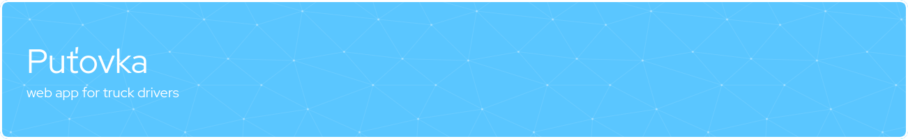

 

 

**_This application is created for truck drivers of a private company._**

**_Users who know the purpose of the app will understand this readme. For others, this is just a basic overview._**

 
 

# Introduction

The primary purpose of the application is to enable drivers to keep a driving log and thus provide them with an overview of their current and past earnings.

 
 

# Used technologies

 

 
 

# Time spent

 

 
 

# Main Features

- Keeping a driving log
- Adding and managing jobs and holidays
- Calculating wages and reimbursements
- Archiving data
- Viewing history and statistics
- Exporting data

 
 

# First steps :

 

## Registration

 

Click on "Ještě nemáte účet? **<u>Zaregistrujte se.</u>**"

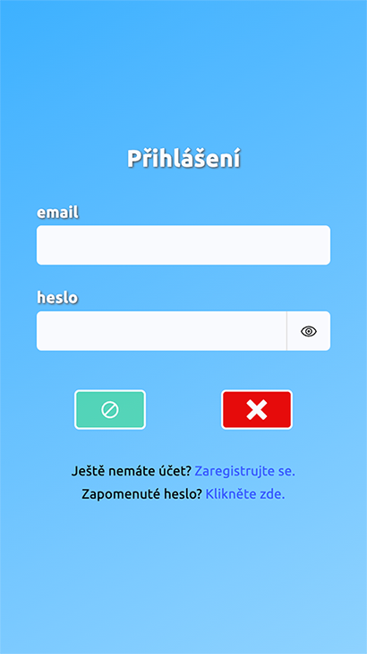

 

Fill in all fields and click on the **green button**.

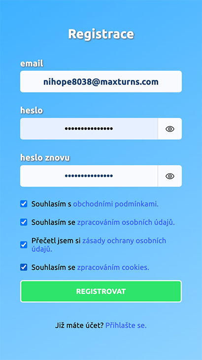

 

Check your email for a new message.

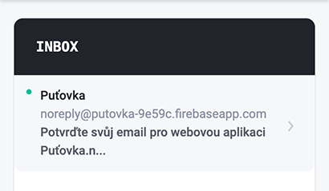

 

Confirm the registration by clicking on the provided URL.

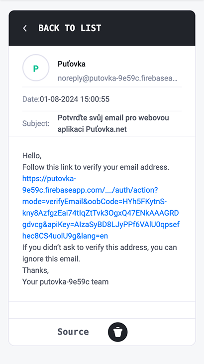

 

## Login

 

Log in with your registration credentials.

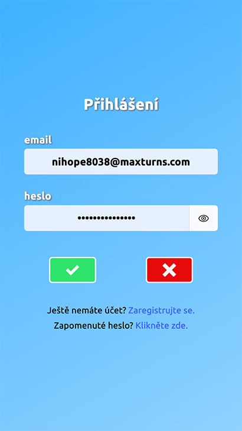

 

## Settings

 

Go to the Settings section and fill in (ideally) all fields.

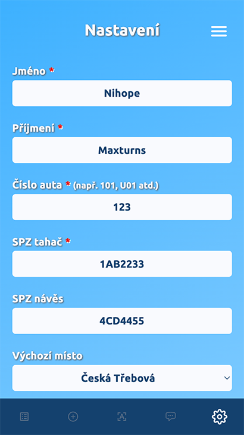

 

## Adding a job or holiday

 

Once you're done, you can add your first job:

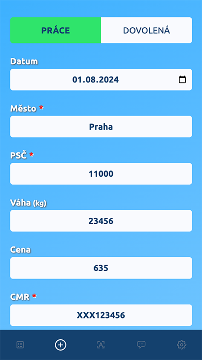

 

You can also add your holidays:

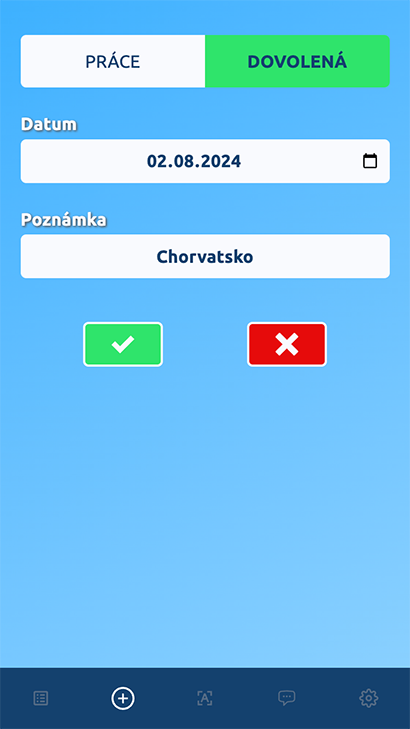

 

## Dashboard

 

1 - Sum of Euros earned from jobs (first line - on the left)

2 - Euros converted to CZK by the last fetched conversion ratio (first line - on the right)

3 - Your stats such as summary of jobs, second jobs (in one day), waiting time, hours spent at work and holiday (line with 4 icons)

4 - Red button to archive your jobs and holidays (important to do when month ends or a new one begins in order to see up-to-date stats)

5 - Your jobs and holidays

 

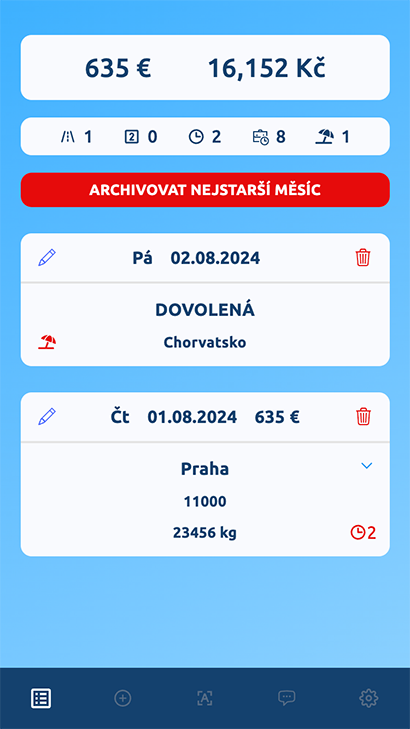

 

## Archive

 

1 - Archived month's date

2 - Sum of earned EUR

3 - Sum of earned CZK

4 - Sum of jobs

5 - Sum of "second" jobs

6 - Sum of waiting

7 - Sum of holidays

8 - CZK / EUR exchange rate of particular month

9 - Button to send statistics via email

 

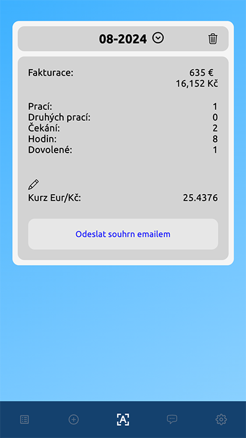

 

Expanded archived month:

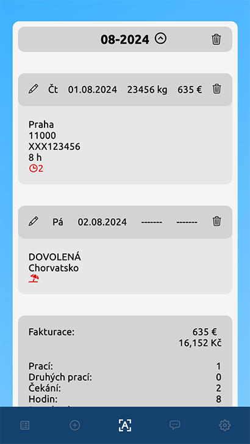

 

### These were main features of the app. You can also do a following things:

 

- Edit job or holiday
- Delete job or holiday
- Send a summary of desired month as an email
- Delete archived month, edit and delete archived month's job or holiday
- View the email you're logged in with
- Log out
- Change email
- Change password
- Reset password
- Delete account

 

and view:

- Consent to Personal Data Processing
- Personal Data Protection Policy
- Cookies Policy
- Support email

 

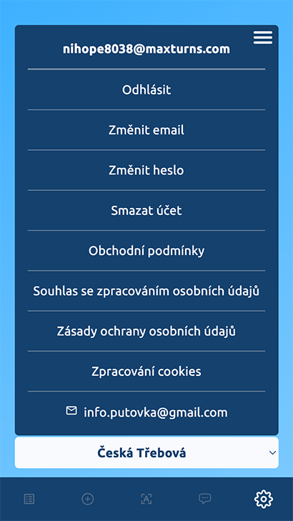
