 
 
 

# Welcome to the emTRUCK web application

 

**This application is created for truck drivers of a private company.**

 

**Users who know the purpose of the app will understand this readme. For others, this is just a basic overview.**

 
 

## Registration

 

Click on "Ještě nemáte účet? **<u>Zaregistrujte se.</u>**"

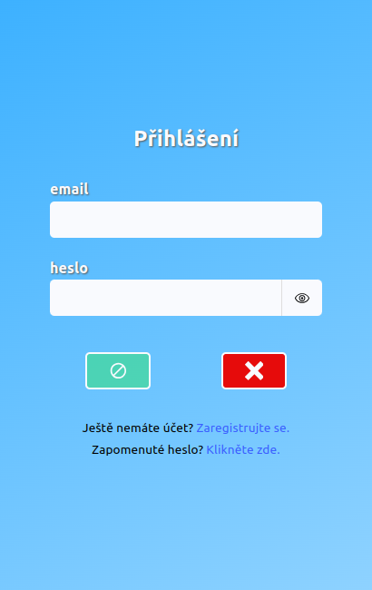

 

Fill in all fields and click on the **green button**.

 

Check your email for a new message.

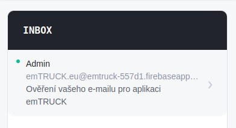

 

Confirm the registration by clicking on the provided URL.

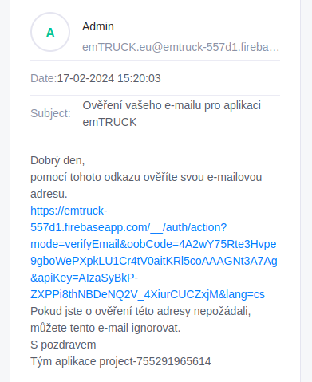

 

## Login

 

Log in with your registration credentials.

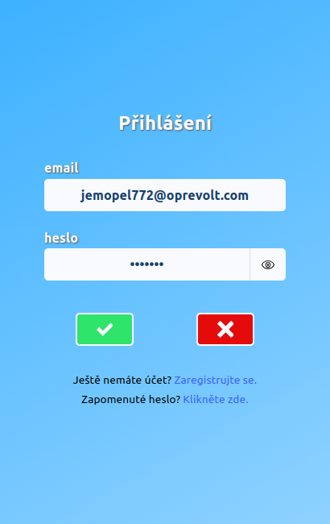

 

## Settings

 

Go to the Settings section and fill in (ideally) all fields.

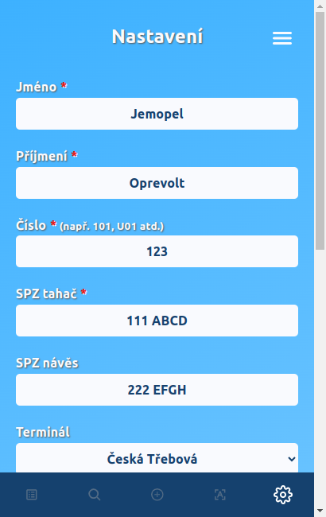

 

## Adding a job or holiday

 

Once you're done, you can add your first job by searching via **city name** or **post Code.**:

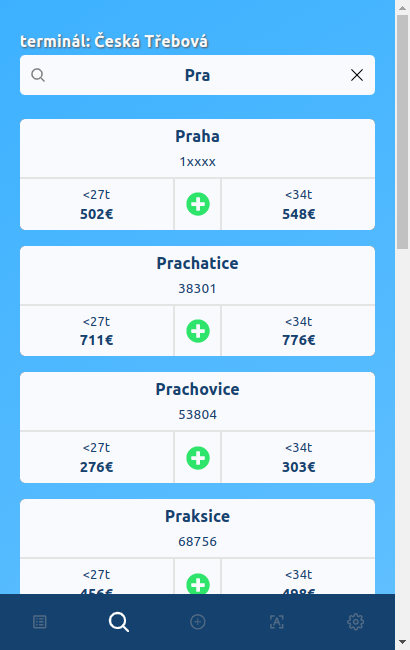

 

If you can't find your job, you can add it manually by filling in all fields yourself:

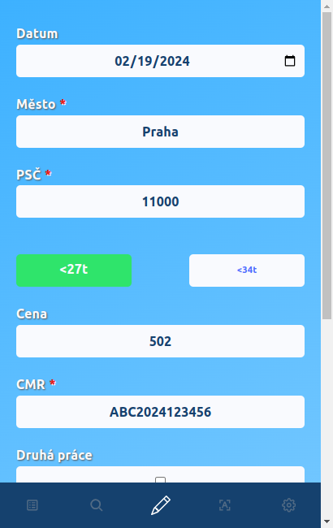

 

You can also add your holidays:

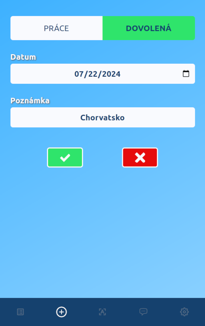

 

## Dashboard

 

1 - Total EUR earned from jobs (top left - first line)

2 - Euros converted to CZK by the last fetched conversion ratio (top left - second line)

3 - Your current salary in CZK (top right)

4 - Your stats such as total jobs, total second jobs in one day, total waiting time, total holiday (line with 4 icons)

5 - Red button to archive your jobs and holidays (important to do when month ends or a new one begins in order to see up-to-date stats)

6 - Your jobs and holidays

 

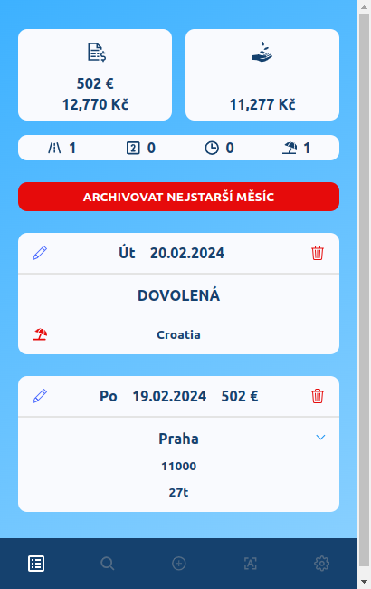

 

## Archive

 

1 - Archived month's date

2 - Total Euros earned

3 - Total CZK earned

4 - Your salary

5 - Total jobs

6 - Total "second" jobs

7 - Total waiting

8 - Total holidays

. . . and your settings at the time of archiving, such as base money, % of earned money, second job benefit, waiting benefit from employer, waiting benefit of company job was done for, and EUR/CZK ratio.

 

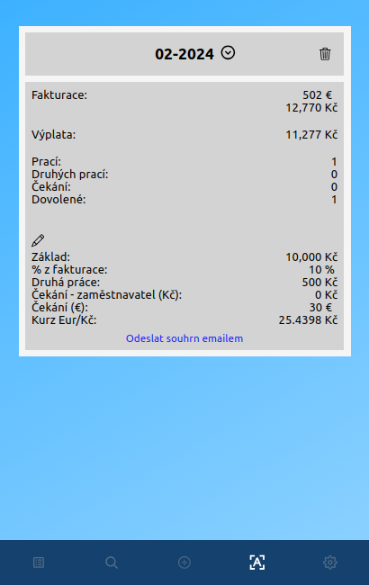

 

Expanded archived month:

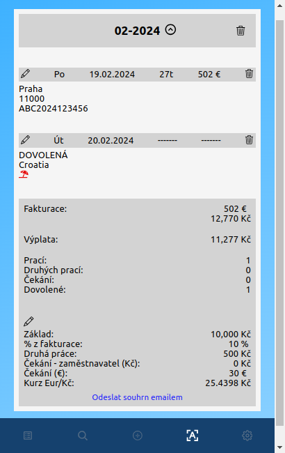

 

### These were main features of the app. You can also do a following things:

 

## Edit job or holiday

 

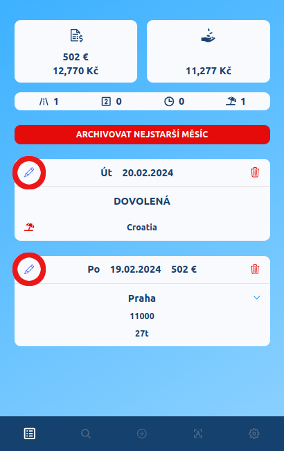

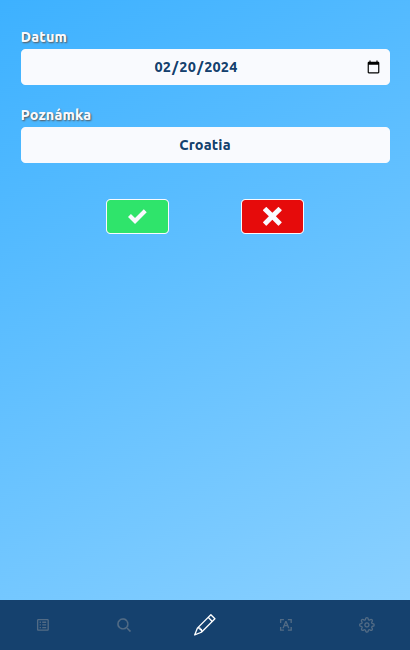

 

## Delete job or holiday

 

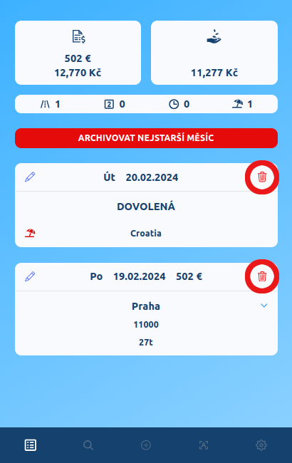

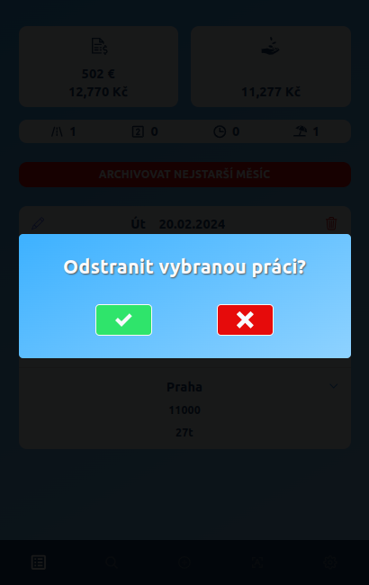

 

## Delete archived month, edit and delete archived month's job or holiday

 

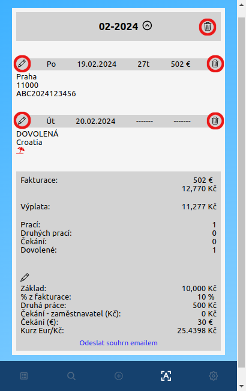

 

## Send a summary of desired month as an email

 

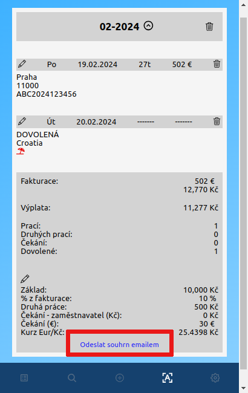

 

## Other things you can do

 

- View the email you're logged in with
- Log out
- Change email
- Change password
- Delete account

 

and view:

- Consent to Personal Data Processing
- Personal Data Protection Policy
- Cookies Policy
- Support email

 

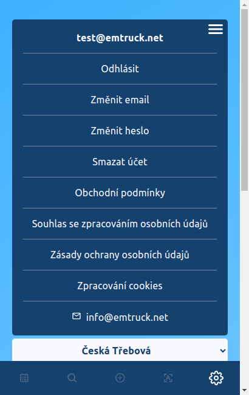
